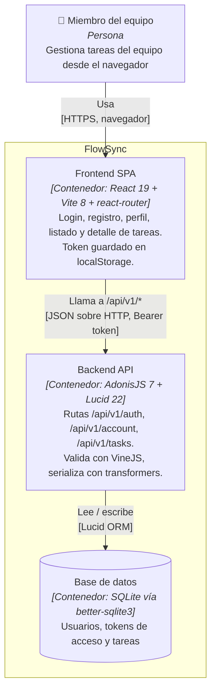

# Arquitectura — diagrama de contenedores (C4)

Este diagrama muestra los contenedores que forman FlowSync tal como existen hoy en el repo: el **frontend SPA** (`frontend/`, React 19 + Vite 8, rutas en `src/routes/app-routes.tsx` y llamadas centralizadas en `src/lib/api.ts`), la **API backend** (`backend/`, AdonisJS 7 con las rutas de `start/routes.ts` bajo `/api/v1` — auth, perfil y tareas —, controladores en `app/controllers/`, modelos `User`/`Task` y transformers de `app/transformers/`) y la **base de datos SQLite** a la que accede vía Lucid ORM (`config/database.ts`, driver `better-sqlite3`). La comunicación entre SPA y API es JSON sobre HTTP con un token Bearer (guard `api` de `config/auth.ts`, tokens de acceso opacos). No se dibuja nada que no esté verificado en el código (no hay, por ejemplo, colas, cachés ni otros servicios externos en el repo).

